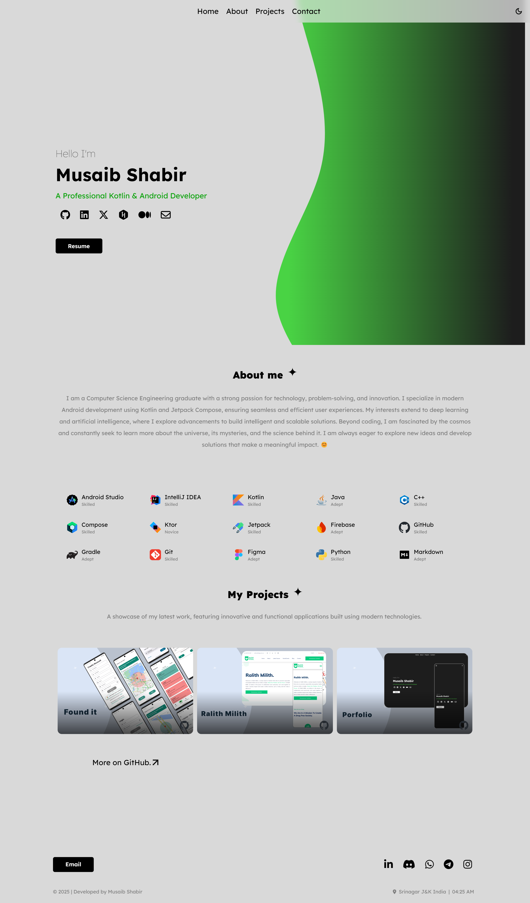

## Portfolio Website

Welcome to my personal portfolio website, built using the [Kobweb](https://github.com/varabyte/kobweb). This site showcases my projects, skills, and experiences.

<p align="center">
  </a>
  </a> 
</p>

## About Kobweb 
Kobweb is an opinionated Kotlin framework for creating websites and web applications. It is built on top of Compose HTML and draws inspiration from frameworks like Next.js and Chakra UI. Kobweb enables developers to use Kotlin and Compose to build rich, dynamic web applications while leveraging the greater Kotlin ecosystem.


## Tech Stack

- **[Kobweb](https://github.com/varabyte/kobweb):** Compose HTML framework for Kotlin multi-platform.
- **[Jetpack Compose](https://developer.android.com/jetpack/compose):** Modern Android UI toolkit for building native UIs in a declarative way.
- **[Kotlin](https://kotlinlang.org/):** Modern programming language for concise and expressive code.


## Previews: 




## Getting Started

Follow these steps to set up Kotfolio locally:

1. **Clone the repository:**
   ```bash
   git clone https://github.com/MusaibShabir/Porfolio.git
   ```

2. **Getting Started**

    First, run the development server by typing the following command in a terminal under the `site` folder:

    ```bash
    $ cd site
    $ kobweb run
    ```

    Open [http://localhost:8080](http://localhost:8080) with your browser to see the result.

You can use any editor you want for the project, but we recommend using **IntelliJ IDEA Community Edition** downloaded
using the [Toolbox App](https://www.jetbrains.com/toolbox-app/).

Press `Q` in the terminal to gracefully stop the server.

<br>
